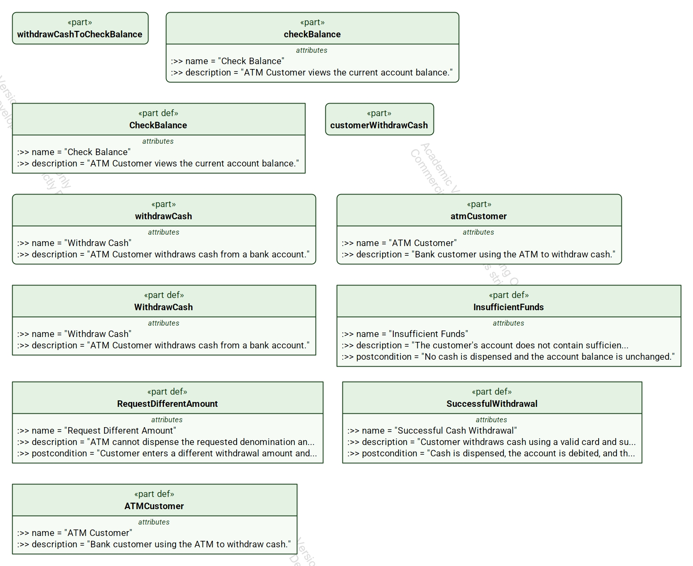

# Structured Use Cases for SysML v2

**A simpler, structured approach to use case modeling in SysML v2.**

Structured Use Cases is an open-source SysML v2 library for describing system behavior using structured use case specifications composed of **scenarios and ordered steps**.

The goal is simple: make use cases easier to write, easier to understand, and more useful for **discovering requirements and generating behavioral tests**.

## Why Structured Use Cases?

The primary engineering value of use case modeling resides in the **use case specification**, not the use case diagram.

A use case specification describes system behavior as a collection of scenarios:

- **Basic scenarios** describe normal behavior.
- **Alternate scenarios** describe valid variations from the normal flow.
- **Exception scenarios** describe error conditions and other off-nominal behavior.

Explicitly modeling alternate and exception behavior helps expose requirements that can easily be missed when only nominal system behavior is considered.

These structured scenarios also provide a natural foundation for systematic behavioral test generation.

## The Structured Use Case Model

The Structured Use Cases library provides a structured representation of use case behavior in SysML v2.


At the center of the model is a straightforward behavioral structure:

**Use Case → Scenario → Step**

A **Use Case** describes a system capability from the perspective of its actors.

Each use case can contain:

- One **Basic Scenario**
- Zero or more **Alternate Scenarios**
- Zero or more **Exception Scenarios**

Each scenario contains an ordered set of **Steps** describing observable behavior.

Scenarios can also define their own **postconditions**, allowing different behavioral paths to terminate in different valid system states.

The model also represents actors and associations so that use cases can be organized into familiar use case diagrams.

## Why Alternate and Exception Scenarios Matter

The normal path through a system is usually the easiest behavior to identify.

Many missing requirements are found by asking:

**What else can happen?**

Alternate scenarios describe legitimate variations in behavior. Exception scenarios describe failures and other off-nominal conditions.

Making these scenarios explicit helps engineers identify behavior that might otherwise remain unspecified until implementation or testing.

This is one of the primary motivations behind Structured Use Cases: **use cases should help discover requirements, not merely document requirements that have already been found.**

## Example: ATM Cash Withdrawal

The ATM example demonstrates the Structured Use Cases concepts using familiar system behavior.



The example includes the **Withdraw Cash** use case and ATM Customer actor, together with several possible scenarios.

For example:

- **Successful Withdrawal** represents the nominal behavior.
- **Request Different Amount** represents an alternate path.
- **Insufficient Funds** represents an exception path.

Each scenario can have its own postcondition. For example, an insufficient-funds scenario can specify that no cash is dispensed and the account balance remains unchanged.

This makes the expected outcome of each behavioral path explicit and testable.

## From Use Cases to Tests

Structured use cases provide more than documentation.

Because behavior is explicitly organized into scenarios and ordered steps, those scenarios can become the basis for behavioral test threads.

The resulting engineering chain is:

**Use Cases → Scenarios → Steps → Test Cases**

Alternate and exception scenarios are particularly valuable because they expose the off-nominal behavior that frequently produces defects when it has not been specified or tested.

Scenario-specific postconditions also provide natural assertions for behavioral testing: after executing a scenario, the resulting system state can be checked against its expected postcondition.

## Library Validation

The repository includes smoke-test material used to exercise the Structured Use Cases library and verify that its major modeling elements can be instantiated.

The smoke test covers elements including:

- Use Case Diagram
- Use Case
- Scenario
- Step
- Actor
- Endpoint
- Association

The corresponding SysML v2 source and rendered model are included in the repository for developers and tool implementers who want to examine or validate the library.

## What's in This Repository?

The repository contains:

- The **Structured Use Cases SysML v2 library**
- Structured use case examples
- Basic, alternate, and exception scenario examples
- SysML v2 source files
- Rendered example models
- Library smoke tests
- Behavioral test-generation examples
- Supporting documentation
- The current Structured Use Cases proposal

## Getting Started

1. Clone or download this repository.
2. Review the Structured Use Cases library in the `library/StructuredUseCases.sysml`.
3. Examine the rendered Structured Use Cases model above.
4. Open the corresponding `.sysml` example to see its textual SysML v2 representation.
5. Review the ATM example to see basic, alternate, and exception scenarios applied to a familiar problem.
6. Review the smoke-test files if you want to validate the library in a SysML v2 environment.
7. Create your own use case using a Basic Scenario and add Alternate and Exception Scenarios as needed.

## Repository Structure

```text
structured-use-cases/
├── README.md
├── LICENSE
├── library/
│   └── StructuredUseCases.sysml
├── examples/
│   ├── StructuredUseCases_ATM_Test.sysml
│   └── StructuredUseCases_SmokeTest.sysml
├── images/
│   ├── StructuredUseCases.jpg
│   ├── StructuredUseCases_ATM_Test.jpg
│   └── StructuredUseCases_SmokeTest.jpg
└── docs/
    ├── Structured_Use_Cases_OMG_Proposal_Draft_v0.5.pdf
    ├── StructuredUseCases_Test_Procedure.md
    └── test case in UCML.txt
```

## Design Philosophy

Structured Use Cases is guided by several principles:

- **Keep use case modeling simple.**
- **Put behavioral detail in the specification.**
- **Use diagrams primarily for organization, communication, and navigation.**
- **Explicitly model alternate and exception behavior.**
- **Use scenarios to discover missing requirements.**
- **Make specifications directly useful for behavioral testing.**
- **Improve the value-to-pain ratio of use case modeling.**

The intent is not to reinvent structured use cases. Structured scenarios have been used successfully in industry for decades.

The goal is to provide a simple, standard semantic representation suitable for the SysML v2 ecosystem.

## Project Status

Structured Use Cases is currently under development and evaluation.

The project provides a practical environment for:

- Experimentation
- Library validation
- Tool interoperability testing
- Development of examples
- Behavioral test-generation experiments
- Community feedback

The approach is also being developed as a proposal for the SysML v2 ecosystem.

## Contributing

Feedback and experimentation are welcome.

Particularly useful contributions include:

- Testing the library with different SysML v2 tools
- Reporting interoperability issues
- Contributing structured use case examples
- Suggesting improvements to the library
- Experimenting with behavioral test generation
- Providing feedback on the Structured Use Cases proposal

Please use GitHub Issues to report problems, suggest improvements, or share results.

## License

See the `LICENSE` file for licensing information.

## About Structured Use Cases

Structured Use Cases is an open-source effort to make use case modeling **simpler, more rigorous, and more useful throughout the systems and software engineering lifecycle**.

Its central idea is deliberately simple:

**Describe what normally happens. Describe what else can happen. Describe what can go wrong. Then test all of it.**
