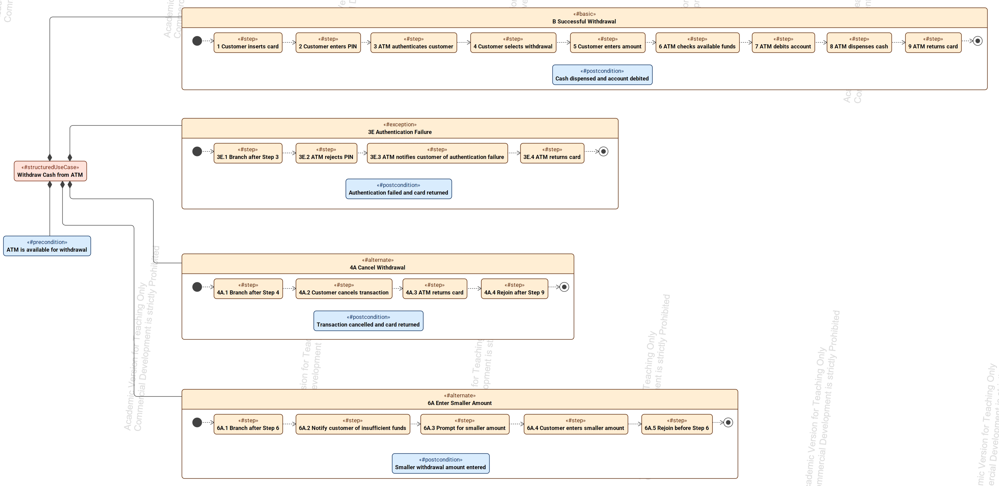
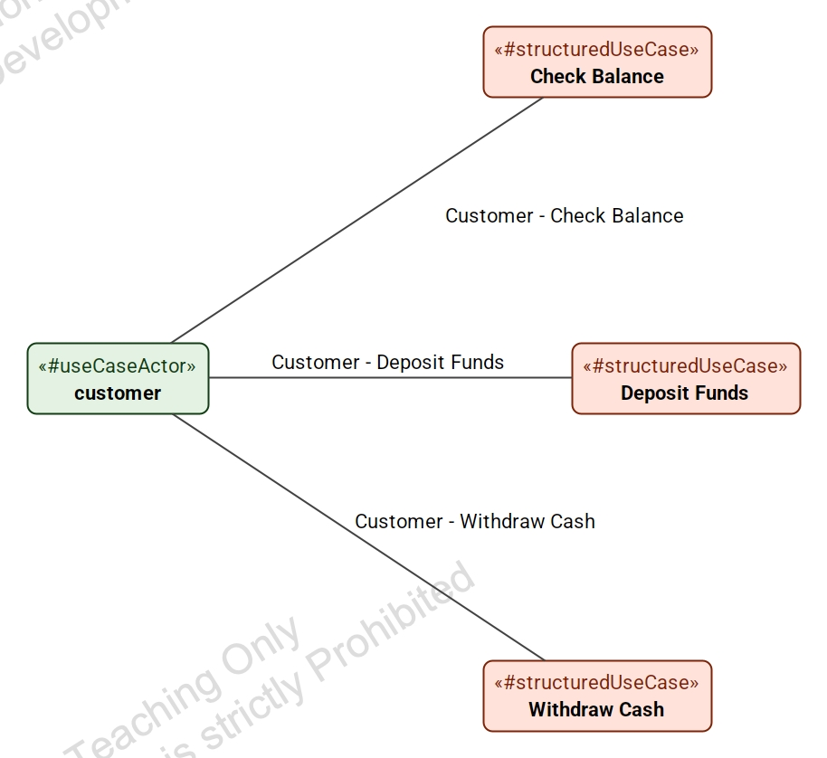
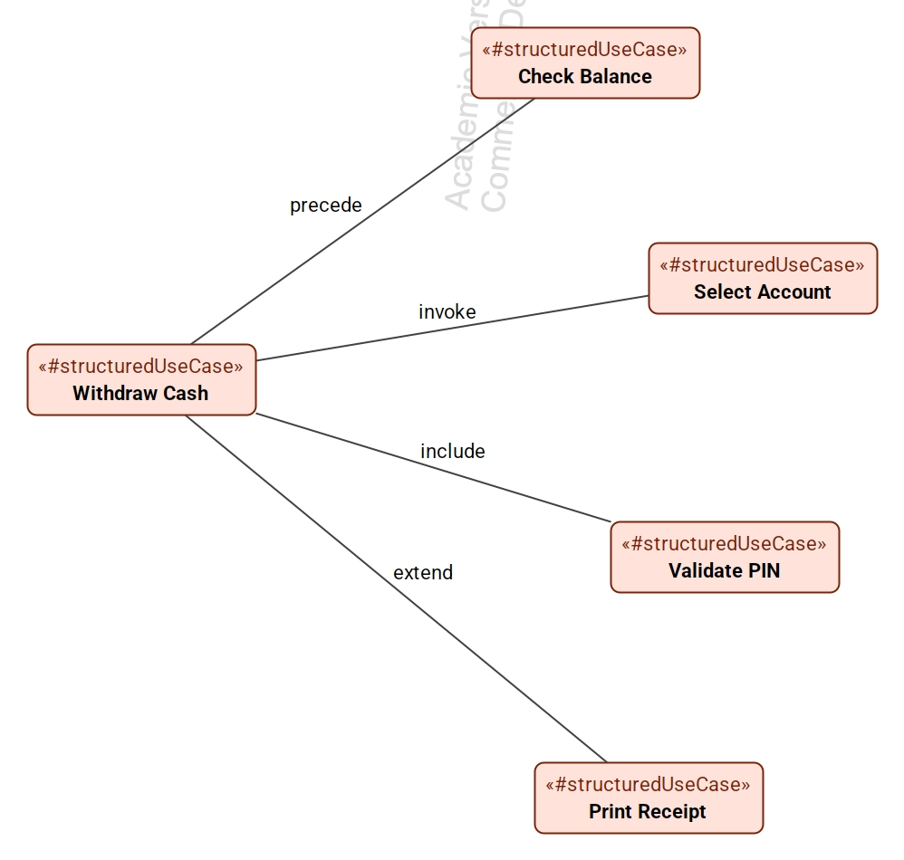

# Structured Use Cases for SysML v2

**A simpler, structured approach to use case modeling in SysML v2.**

Structured Use Cases is an open-source SysML v2 library for describing system behavior using structured use case specifications composed of **scenarios and ordered steps**.

The goal is simple: make use cases easier to write, easier to understand, and more useful for **discovering requirements, generating behavioral tests, and performing model-based analysis**.

## Try the Structured Use Case Editor

A free, browser-based reference editor is available here:

**https://parallelagile.com/structured-use-cases/**

The Structured Use Case Editor provides a human-oriented environment for creating structured use case diagrams and specifications while generating native SysML v2 for downstream modeling tools.

Editor source:

**https://github.com/Open-MBEE/structured-usecase-editor**

## Current Release — v0.7

Version 0.7 extends the project from a SysML v2 library and proposal into a more complete working reference implementation.

The underlying Structured Use Cases library continues to build on native SysML v2 semantics. Structured use cases specialize SysML v2 use cases, scenarios and steps use action semantics, preconditions and postconditions use constraint semantics, and semantic metadata identifies structured use case concepts without creating a parallel modeling language.

The accompanying Structured Use Case Editor now provides practical authoring, persistence, and SysML v2 export capabilities.

### What's New in Version 0.7

- **UCML has been deprecated.** The reference editor now generates SysML v2 textual notation directly.
- The deployed **Structured Use Case Editor v0.8** provides a working reference implementation of the proposed approach.
- Complete use case models can be **saved and reopened** as Use Case Model JSON files using the `.ucm.json` extension.
- Generated SysML v2 can be **copied to the clipboard** or exported as a `.sysml` file.
- Exported SysML v2 has been tested with **Cameo SysML v2 import workflows**.
- Cameo testing informed cleaner serialization of native SysML v2 use cases, actions, constraints, and successions.
- The diagram editor now supports practical authoring improvements including **resizable use case bubbles** and **relationship-drag preview feedback**.

## Why Structured Use Cases?

The primary engineering value of use case modeling resides in the **use case specification**, not the use case diagram.

A use case specification describes system behavior as a collection of scenarios:

- **Basic scenarios** describe normal behavior.
- **Alternate scenarios** describe valid variations from the normal flow.
- **Exception scenarios** describe error conditions and other off-nominal behavior.

Explicitly modeling alternate and exception behavior helps expose requirements that can easily be missed when only nominal system behavior is considered.

These structured scenarios also provide a natural foundation for systematic behavioral test generation.

## The Structured Use Case Model

The Structured Use Cases library provides a structured representation of use case behavior while building on native SysML v2 concepts rather than defining a parallel use case language.


At the center of the model is a straightforward behavioral structure:

**Use Case → Scenario → Step**

A structured use case is a SysML v2 use case. Scenarios and steps use SysML v2 action semantics, while preconditions and postconditions use constraint semantics. Semantic metadata identifies elements as structured use cases, basic scenarios, alternate scenarios, exception scenarios, steps, preconditions, postconditions, and use case actors.

Each structured use case can contain one **Basic Scenario**, zero or more **Alternate Scenarios**, and zero or more **Exception Scenarios**. Standard SysML v2 successions define behavioral ordering. Scenario-specific postconditions allow different behavioral paths to terminate in different valid system states.

## Why Alternate and Exception Scenarios Matter

The normal path through a system is usually the easiest behavior to identify. Many missing requirements are found by asking:

**What else can happen?**

Alternate scenarios describe legitimate variations in behavior. Exception scenarios describe failures and other off-nominal conditions.

**Use cases should help discover requirements, not merely document requirements that have already been found.**

## Example: ATM Cash Withdrawal

The repository includes `examples/WithdrawCash_ATM_Example.sysml`.



The example demonstrates a basic successful-withdrawal scenario, alternate and exception behavior, ordered steps using SysML v2 successions, branch points, narrative rejoin steps, a use-case-level precondition, and scenario-specific postconditions.

## From the Editor to SysML v2

The Structured Use Case Editor provides a lightweight front end for structured use case authoring. A modeler can create diagrams and specifications, save the complete model as `.ucm.json`, reopen it later, inspect generated SysML v2, copy it to the clipboard or export it as `.sysml`, and import the resulting model into a SysML v2-capable environment such as Cameo.

Try it here:

**https://parallelagile.com/structured-use-cases/**

## From Use Cases to Tests

Because behavior is explicitly organized into scenarios, steps, branches, rejoins, and outcomes, the model can be traversed to derive complete behavioral threads.

**Use Cases → Scenarios → Steps → Behavioral Threads → Tests**

The v0.7 proposal describes a conceptual **Use Case Thread Expander** that systematically traverses modeled use case behavior to identify end-to-end threads for testing.

## Queryable Engineering Information

Once detailed use case behavior is represented as explicit model semantics, it becomes **queryable engineering information**. Version 0.7 explores queries to find use cases without off-nominal behavior, extract candidate requirements, find scenarios without postconditions, expand behavioral threads, and trace requirements through behavior to verification.

## More Permissive Use Case Diagrams

The library provides a reusable `UseCaseActor` identified through semantic metadata rather than requiring the SysML v2 actor-parameter mechanism.

`examples/ReusableActor_Example.sysml`



It also includes `examples/UseCaseConnections_Example.sysml`.



This demonstrates simple named connections including `include`, `extend`, `invoke`, and `precede`.

## What's in This Repository?

- The **Structured Use Cases SysML v2 library**
- The current **v0.7 OMG proposal draft**
- A detailed ATM structured use case example
- A reusable-actor example
- A use-case-connections example
- Supporting images and documentation
- Material supporting requirements discovery, behavioral testing, and model-based analysis

Companion editor:

**https://github.com/Open-MBEE/structured-usecase-editor**

Deployed reference editor:

**https://parallelagile.com/structured-use-cases/**

## Getting Started

1. Try the hosted editor.
2. Review `library/StructuredUseCases_Library.sysml`.
3. Open `examples/WithdrawCash_ATM_Example.sysml`.
4. Review `examples/ReusableActor_Example.sysml`.
5. Review `examples/UseCaseConnections_Example.sysml`.
6. Read the v0.7 proposal in `docs/`.
7. Create a structured use case with a Basic Scenario, then explore alternate and exception behavior.

## Repository Structure

```text
structured-use-cases/
├── README.md
├── LICENSE
├── library/
│   └── StructuredUseCases_Library.sysml
├── examples/
│   ├── WithdrawCash_ATM_Example.sysml
│   ├── ReusableActor_Example.sysml
│   └── UseCaseConnections_Example.sysml
├── images/
└── docs/
    └── Structured_Use_Cases_OMG_Proposal_Draft_v0.7.pdf
```

## Design Philosophy

- **Keep use case modeling simple.**
- **Build on native SysML v2 semantics rather than creating a parallel modeling language.**
- **Put behavioral detail in the specification.**
- **Use diagrams primarily for organization, communication, and navigation.**
- **Explicitly model alternate and exception behavior.**
- **Use scenarios to discover missing requirements.**
- **Make specifications directly useful for behavioral testing.**
- **Make modeled behavior available for queries, automation, and analysis.**
- **Improve the value-to-pain ratio of use case modeling.**

## Project Status

Structured Use Cases is under active development and evaluation. Version 0.7 combines the SysML v2 library with a working open-source reference editor and a tested editor-to-SysML-v2 workflow.

## Contributing

Feedback and experimentation are welcome. Please use GitHub Issues to report problems, suggest improvements, contribute examples, or share interoperability, testing, query, and automation results.

## License

See the `LICENSE` file for licensing information.

## About Structured Use Cases

Structured Use Cases is an open-source effort to make use case modeling **simpler, more rigorous, and more useful throughout the systems and software engineering lifecycle**.

**Describe what normally happens. Describe what else can happen. Describe what can go wrong. Then test all of it.**
