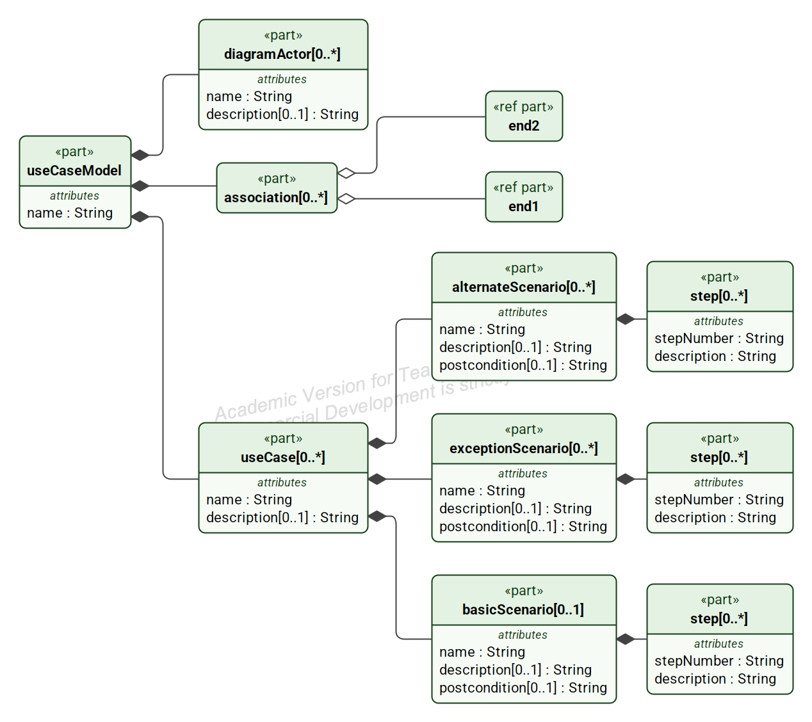

# Structured Use Cases for SysML v2

**A simpler, structured approach to use case modeling in SysML v2.**

Structured Use Cases is an open-source SysML v2 library for describing
system behavior using structured use case specifications composed of
**scenarios and ordered steps**.

The goal is simple: make use cases easier to write, easier to
understand, and more useful for **discovering requirements, generating
behavioral tests, and performing model-based analysis**.

## Companion Project

The Structured Use Cases library defines the SysML v2 semantics for
structured use case specifications. The companion **Structured Use Case
Editor** provides an open-source reference editor for creating and
editing structured use case diagrams and specifications.

Editor: https://github.com/Open-MBEE/structured-use-case-editor

## Current Release --- v0.6

Version 0.6 substantially revises the Structured Use Cases library to
build on native SysML v2 semantics. Structured use cases specialize
SysML v2 use cases, scenarios and steps use action semantics,
preconditions and postconditions use constraint semantics, and semantic
metadata identifies structured use case concepts without creating a
parallel modeling language.

The result is a lightweight library that preserves familiar structured
use case concepts while making detailed behavioral information available
for **requirements discovery, behavioral testing, model queries,
automation, and AI-assisted engineering**.

This repository includes:

-   The current **Structured Use Cases proposal, v0.6**, in `docs/`
-   The current **Structured Use Cases SysML v2 library** in `library/`
-   A detailed **ATM structured use case** example
-   A **reusable actor** connected to multiple use cases
-   Examples of named **use-case-to-use-case connections**

## Why Structured Use Cases?

The primary engineering value of use case modeling resides in the **use
case specification**, not the use case diagram.

A use case specification describes system behavior as a collection of
scenarios:

-   **Basic scenarios** describe normal behavior.
-   **Alternate scenarios** describe valid variations from the normal
    flow.
-   **Exception scenarios** describe error conditions and other
    off-nominal behavior.

Explicitly modeling alternate and exception behavior helps expose
requirements that can easily be missed when only nominal system behavior
is considered.

These structured scenarios also provide a natural foundation for
systematic behavioral test generation.

## The Structured Use Case Model

The Structured Use Cases library provides a structured representation of
use case behavior while building on native SysML v2 concepts rather than
defining a parallel use case language.



At the center of the model is a straightforward behavioral structure:

**Use Case → Scenario → Step**

A structured use case is a SysML v2 use case. Scenarios and steps use
SysML v2 action semantics, while preconditions and postconditions use
constraint semantics. Semantic metadata identifies elements as
structured use cases, basic scenarios, alternate scenarios, exception
scenarios, steps, preconditions, postconditions, and use case actors.

Each structured use case can contain:

-   One **Basic Scenario**
-   Zero or more **Alternate Scenarios**
-   Zero or more **Exception Scenarios**

Each scenario contains an ordered set of **Steps** describing behavior.
Standard SysML v2 successions define behavioral ordering rather than
duplicating control flow in custom library properties.

Scenarios can define their own **postconditions**, allowing different
behavioral paths to terminate in different valid system states.

Human-readable scenario and step identifiers support familiar structured
use case presentation while the underlying model retains explicit
behavioral semantics.

## Why Alternate and Exception Scenarios Matter

The normal path through a system is usually the easiest behavior to
identify.

Many missing requirements are found by asking:

**What else can happen?**

Alternate scenarios describe legitimate variations in behavior.
Exception scenarios describe failures and other off-nominal conditions.

Making these scenarios explicit helps engineers identify behavior that
might otherwise remain unspecified until implementation or testing.

This is one of the primary motivations behind Structured Use Cases:
**use cases should help discover requirements, not merely document
requirements that have already been found.**

Once off-nominal behavior is explicitly modeled, it can also support
requirements extraction. For example, an **Authentication Failure**
exception scenario can lead directly to a candidate requirement to
**Handle Authentication Failure**, while the scenario remains the
authoritative specification of the detailed behavior.

## Example: ATM Cash Withdrawal

The repository includes a detailed ATM example in:

`examples/WithdrawCash_ATM_Example.sysml`


The **Withdraw Cash from ATM** use case demonstrates:

-   A basic successful-withdrawal scenario
-   Alternate behavior such as cancelling a withdrawal or entering a
    smaller amount
-   Exception behavior such as authentication failure
-   Ordered steps using SysML v2 successions
-   Branch points represented by named successions
-   Narrative rejoin steps
-   A use-case-level precondition
-   Scenario-specific postconditions

The example illustrates an important principle: a use case step does
**not** need to be a system action. Steps can describe observable
interaction involving the actor and the system, such as a customer
inserting a card or entering a PIN.

## From Use Cases to Tests

Structured use cases provide more than documentation.

Because behavior is explicitly organized into scenarios, steps,
branches, rejoins, and outcomes, the model can be traversed to derive
complete behavioral threads.

The resulting engineering chain is:

**Use Cases → Scenarios → Steps → Behavioral Threads → Tests**

Alternate and exception scenarios are particularly valuable because they
expose off-nominal behavior that frequently produces defects when it has
not been specified or tested.

Scenario-specific postconditions also provide natural assertions for
behavioral testing: after executing a behavioral thread, the resulting
system state can be checked against the expected postcondition.

The v0.6 proposal describes a conceptual **Use Case Thread Expander**
that systematically traverses modeled use case behavior to identify the
complete end-to-end threads that should be considered during testing.

## Queryable Engineering Information

Once detailed use case behavior is represented as explicit model
semantics rather than embedded only in prose, it becomes **queryable
engineering information**.

Version 0.6 explores several immediately useful queries:

1.  **Find use cases with no alternate or exception scenarios.**
2.  **Extract candidate requirements from off-nominal behavior.**
3.  **Find scenarios without postconditions.**
4.  **Expand a use case into its complete set of behavioral threads.**
5.  **Trace requirements through use case behavior to verification.**

These examples barely scratch the surface. The larger opportunity is
that the same structured behavioral semantics can support queries,
validation rules, automated transformations, AI agents, test generators,
and other engineering tools without changing the underlying use case
specification.

## More Permissive Use Case Diagrams

Structured Use Cases focuses engineering attention on the detailed
specification without unnecessarily restricting familiar use case
diagrams.

The library provides a reusable `UseCaseActor` identified through
semantic metadata rather than requiring the SysML v2 actor-parameter
mechanism.

The repository includes:

`examples/ReusableActor_Example.sysml`


This example demonstrates one reusable actor connected to multiple
structured use cases.

The repository also includes:

`examples/UseCaseConnections_Example.sysml`


This example demonstrates simple named connections between structured
use cases, including:

-   `include`
-   `extend`
-   `invoke`
-   `precede`

The intent is not to prescribe formal semantics for these relationship
names. It is to demonstrate that structured use cases can participate in
lightweight, familiar use case diagrams while their detailed behavioral
specifications provide the primary engineering value.

## What's in This Repository?

The repository contains:

-   The **Structured Use Cases SysML v2 library**
-   The current **v0.6 proposal**
-   A detailed ATM structured use case example
-   A reusable-actor example
-   A use-case-connections example
-   Supporting images and documentation
-   Material supporting requirements discovery, behavioral testing, and
    model-based analysis

## Getting Started

1.  Clone or download this repository.
2.  Review `library/StructuredUseCases_Library.sysml`.
3.  Open `examples/WithdrawCash_ATM_Example.sysml` to see a detailed
    structured use case.
4.  Review `examples/ReusableActor_Example.sysml` to see one actor
    connected to multiple use cases.
5.  Review `examples/UseCaseConnections_Example.sysml` to see named
    connections between use cases.
6.  Read the current v0.6 proposal in `docs/` for the motivation,
    library design, testing approach, and query examples.
7.  Create your own structured use case with a Basic Scenario, then ask
    what alternate and exception behavior should also be modeled.

## Repository Structure

``` text
structured-use-cases/
├── README.md
├── LICENSE
├── library/
│   └── StructuredUseCases_Library.sysml
├── examples/
│   ├── WithdrawCash_ATM_Example.sysml
│   ├── ReusableActor_Example.sysml
│   └── UseCaseConnections_Example.sysml
├── images/
└── docs/
    ├── Structured_Use_Cases_OMG_Proposal_Draft_v0.6.pdf
    └── supporting documentation
```

## Design Philosophy

Structured Use Cases is guided by several principles:

-   **Keep use case modeling simple.**
-   **Build on native SysML v2 semantics rather than creating a parallel
    modeling language.**
-   **Put behavioral detail in the specification.**
-   **Use diagrams primarily for organization, communication, and
    navigation.**
-   **Explicitly model alternate and exception behavior.**
-   **Use scenarios to discover missing requirements.**
-   **Make specifications directly useful for behavioral testing.**
-   **Make modeled behavior available for queries, automation, and
    analysis.**
-   **Improve the value-to-pain ratio of use case modeling.**

The intent is not to reinvent structured use cases. Structured scenarios
have been used successfully in industry for decades.

The goal is to provide a simple semantic representation suitable for the
SysML v2 ecosystem while preserving the practical engineering value of
detailed use case specifications.

## Project Status

Structured Use Cases is under active development and evaluation.

Version 0.6 reflects substantial testing and refinement of the library
architecture, including native SysML v2 use case and action semantics,
semantic metadata, reusable actors, behavioral ordering with
successions, scenario-specific postconditions, and permissive use case
connections.

The project provides a practical environment for:

-   Library validation
-   Tool interoperability testing
-   Development of examples
-   Requirements-discovery experiments
-   Behavioral test-generation experiments
-   Model queries and automation
-   AI-assisted engineering experiments
-   Community feedback

The approach is also being developed as a proposal for the SysML v2
ecosystem.

## Contributing

Feedback and experimentation are welcome.

Particularly useful contributions include:

-   Testing the library with different SysML v2 tools
-   Reporting interoperability issues
-   Contributing structured use case examples
-   Suggesting improvements to the library
-   Experimenting with requirements discovery
-   Experimenting with behavioral test generation
-   Developing useful queries over structured use case models
-   Providing feedback on the Structured Use Cases proposal

Please use GitHub Issues to report problems, suggest improvements, or
share results.

## License

See the `LICENSE` file for licensing information.

## About Structured Use Cases

Structured Use Cases is an open-source effort to make use case modeling
**simpler, more rigorous, and more useful throughout the systems and
software engineering lifecycle**.

Its central idea is deliberately simple:

**Describe what normally happens. Describe what else can happen.
Describe what can go wrong. Then test all of it.**
